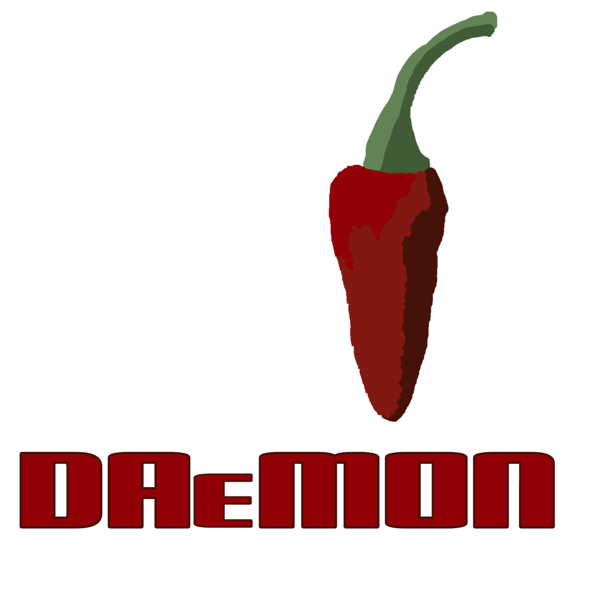

<div align="left">
    <h1>
    <br>Dæmon
    </h1>
    <p>The ultimate music production software.</p>
</div>

Features
--------
* Piano roll - you know what it does.
* Pattern editor - making beats
* Powerful instruments
* VST plugin support
* Lots of ready to use samples
* and FL Studio like UI

Dæmon is basically a Fruityloops clone. It is free and open source so that means everyone can use it to make music.

Daemon prototype

Build and run

To build the Go application:

```bash
make build
```

To build example plugin:

```bash
make plugin
```

To build the C++ helper:

```bash
make cpp
```

To run the GUI app:

```bash
make run
```

To run in headless/container mode:

```bash
DAEMON_HEADLESS=1 make run
```

Project files use the .dmon extension.

Recent projects and workspace state are saved to `.daemon_workspace.json` in the current directory. Plugin metadata is displayed in the UI when plugins expose a `Metadata()` symbol.